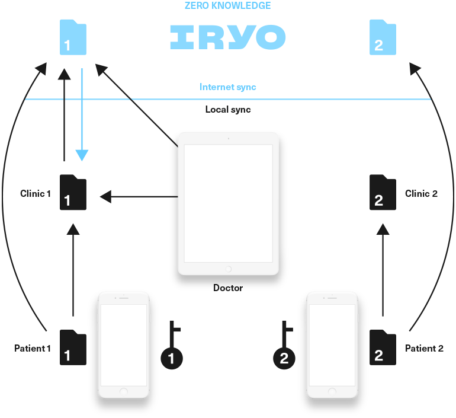

# **Zero-Knowledge storage**

The Iryo Network is a global repository of openEHR data. Since few people are prepared to provide their medical data to a “GoogleEHR”-type of capture and shameless reaping of all the medical data for commercial purposes, Iryo has decided to give up it’s access to plain data. Iryo perceives the medical data it holds as a [“toxic asset”](https://www.schneier.com/blog/archives/2016/03/data_is_a_toxic.html), because we believe that holding too much data in one place presents too large a liability risk.

The solution to managing this risk is zero-knowledge data storage which is resistant to all attacks, including state-actors or “inside jobs’’. This works by way of users encrypting their data on their mobile device\(s\) with a public key.

A private decryption key remains on the patient’s device. Whenever someone wants to access patient data \(a doctor or researcher, for example\) the patient has to approve their access. This will be done by the patient clicking “yes’’ in their IryoEHR app. This gives a re-encryption key to the doctor’s public key. You can read more under the “Private key management section” to understand the details of this process and the application to the edge cases.

Copies of encrypted health records are stored on three geographically and managerially redundant storage nodes.

1. One encrypted backup copy stays on Iryo cloud node. This is the default backup location that can be changed by a clinic or end-user to point to another storage API. The Iryo offering is centralized in the cloud with tight provisioning controls.  
   **Pros**: audited, maintained, secured and backed-up  
   **Cons**: centralized

2. A second encrypted copy stays in the home clinic storage node.  
   **Pros**: local copy, the clinic doesn't need to rely on an internet connection and it is fairly distributed  
   **Cons**: clinics’ IT personnel lack specialization in secure deployment

3. End-user devices \(phones\) distributed all over the world.  
   **Pros**: decentralized \(not centrally controlled\) and protected by thousands of people at the same time.  
   **Cons**: not enough space for all raw data, malware infected devices and old/lost or stolen devices

Whenever data on end-user devices \(point three above\) is updated, the other devices would connect to the API of both redundant storage nodes \(points one and two above\) and sync/update the encrypted data to match the local copy. Both storage nodes would provide a “blockchain proof” \(cryptographic receipt\) of the location of the data saved with the same hash that clients requested. Clients would validate these by asking the independent node if the data was actually put in a chain.

If the device contains more current data \(which could happen when a doctor syncs health record with a more recent version\), then it would only connect to one endpoint API. This would be one that is reachable - preferably the local one \(point two above\) in the same clinic. In this manner, read access doesn’t consume hospital internet connection.

The diversity of network topologies and endpoint reachability would allow clinics to operate even if their local network was down \(as long as they can find emergency hotspot\). This greatly reduces risks of access outages which could have fatal consequences.

While there could be a complete loss of data at each of these points independently, when working in unison they provide reliable and robust system redundancy.

### **Risks in distributed data storage systems like Filecoin/Sia/Storj/Maidsafe**

The problem with distributed systems like Filecoin/Sia/Storj/MaidSafe is that they can’t protect users from attackers storing and serving all data from the single server. Attackers can pretend to be geographically distributed and collect money for all 3-5 copies \(Sybil attack\). Trusting devices, hospitals, and the Iryo Network to keep at least one \(encrypted\) copy alive offers far greater guarantees against health data loss.

### **Who pays for the storage in Iryo Network?**

All text-based data will be funded by clinics who would stake IRYO tokens. and the 1% yearly inflation would be partly used to cover the cost of storage on the Iryo platform.

In some cases, in order to secure the storage of additional gigabytes of raw data being generated and stored, clinics would have to stake additional tokens. If patient-users do not want to be dependent on the staking decisions of their clinics, they would have the option to stake coins themselves. This would unlock the storage for their use, and limit potential abusers.

The precise staking requirement would be updated based on the real data gathered when the Iryo Network goes live. We foresee that, at scale, this would be significantly cheaper than any current decentralized storage, especially in comparison to proprietary systems that cannot be easily upgraded.

The Iryo Network has distanced itself from the current fixation on “Big Data” and has chosen to rather focus on patient privacy. This alternative focus would allow the Iryo Network to scale globally, enabling it to attract more users. Because users, clinics and governments are assured data security and privacy, storing data on the Iryo platform means that the number of users willing to share their data with researchers could increase the rate of current EHR participation significantly. Open-source end-user apps would ensure that there are no secret back-doors circumventing the protection.

